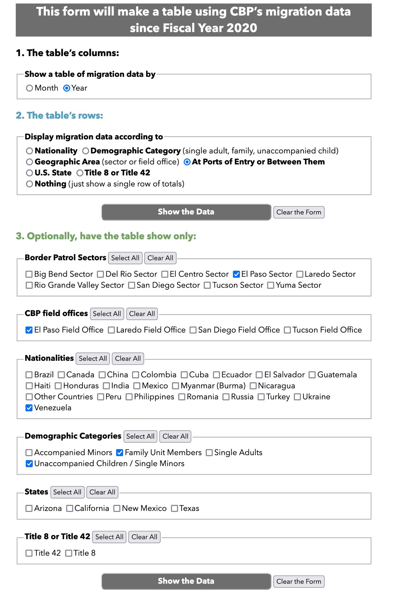
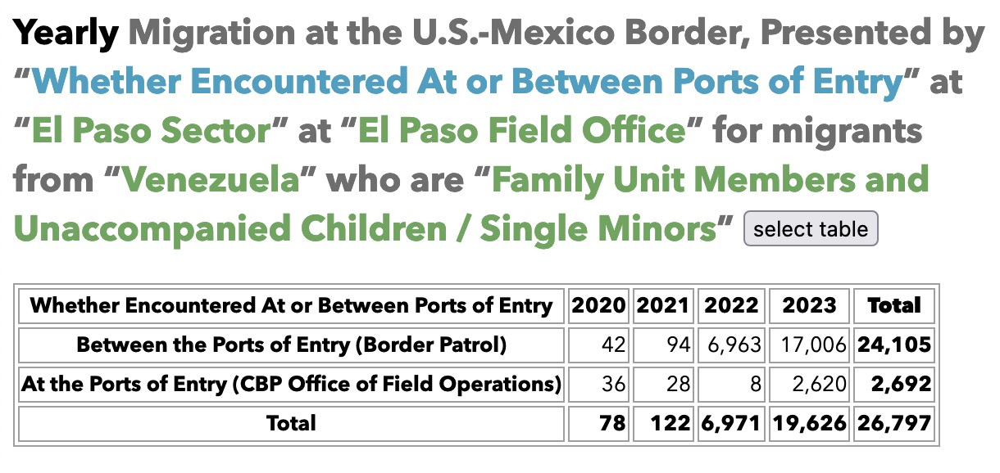
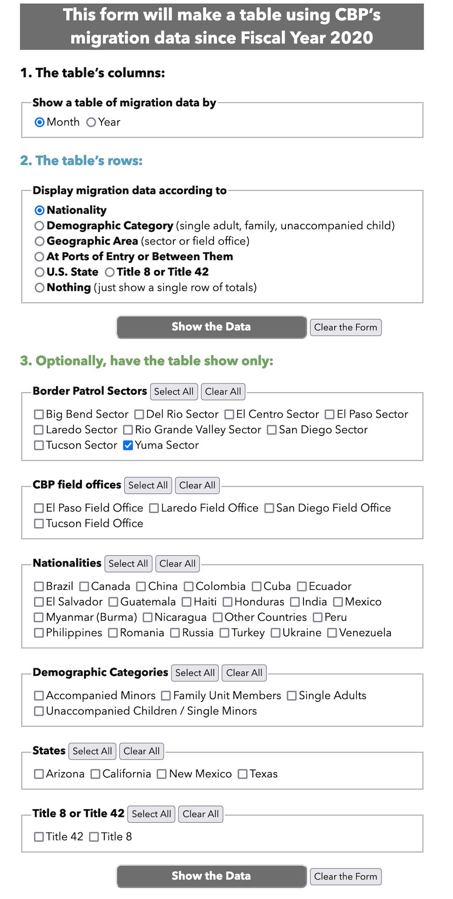
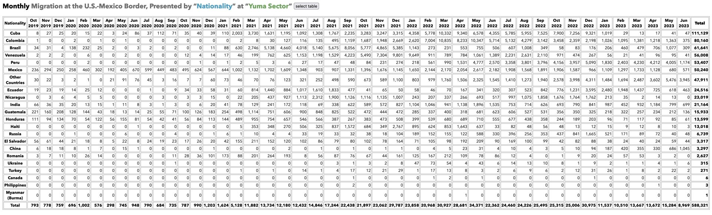

Every month, U.S. Customs and Border Protection (CBP) [publishes an updated dataset][dataset] of the agency’s encounters with migrants since fiscal year 2020 (October 2019). Through July 2023, that’s a CSV file with 61,567 rows.

This is a simple PHP + MySQL tool that queries this dataset. It has two functional pages:

- index.php, the landing page, is a form full of radio buttons and checkboxes. The user specifies
  - whether they want data by year or month,
  - what the table’s rows should show (nationalities, demographic categories, geographic areas where migrants arrive, states where migrants arrive, whether at or between ports of entry, whether Title 8 or Title 42, or just a plain total), and
  - any optional criteria they want to specify—like “show me Venezuelan family-unit members subjected to Title 42 in the Tucson Sector.” (The total is “632,” incidentally.)
- cbp_data_table.php, the page that generates the table. The page’s title changes to reflect what the user chose to display. A button lets the user instantly select the table, so they can work on it elsewhere, like a spreadsheet app.

*(Form showing a search for, by year, how many Venezuelan family-unit members and unaccompanied children came to ports of entry, or between ports of entry, in Border Patrol's El Paso Sector and CBP's El Paso Field Office)*

*(Results of submitting that form)*

The form at index.php generates a GET request, which means that every search creates a unique URL for the cbp_data_table.php page, making it easy to share a table.

There are two other files:

- functions-git.php: rename this file “functions.php” and add your MySQL database username, password, and similar credentials.
- data.sql: this is CBP’s database as a MySQL table. I’ll update this every month when new data comes out. I’ve changed the column headers to names that made sense to me and don’t have spaces; otherwise the data is just as CBP presents it.

I have a functioning version of this that I consult often for my work monitoring trends at the border. But **it runs slow**: if asking for data by month, it can take 10-20 seconds to generate the table, as it performs a MySQL query to obtain the total for each cell. And if it’s a monthly table since October 2019, that’s a lot of cells. 

*The slowness is a problem, and it may owe to my lack of skill—I don't code very often, and my skills aren’t razor-sharp.*

Because of the server load, I’m not sharing the URL of my functioning version.

But most of the time, I just run it on my own computer, unconnected to the internet. You can do that for free by running a local web server on your computer with the non-pro version of:

- [MAMP][MAMP] (for Mac)
- [WAMP][WAMP] (for Windows)
- [LAMP][LAMP] (for Linux)

On MAMP at least, once MAMP is running, create a database, call it “cbp_data,” go to http://localhost:8888/phpMyAdmin/ and import the data.sql file into cbp_data.

MAMP, which I use, uses a folder called “htdocs,” inside the /MAMP folder in your /Applications folder. Copy all 3 of this repository's php files in into that folder (or a subfolder that you make, if you prefer).

If that worked, then change your credentials in the “functions-git.php” file (in a comment there, I’ve included the credentials that work for me in MAMP), and rename it “functions.php.”

Then navigate your browser to http://localhost:8888/, adding to the URL the name of a subfolder if you used one (mine is http://localhost:8888/cbpdata/). You should be viewing the form asking what the table should display.

[dataset]: https://www.cbp.gov/document/stats/nationwide-encounters
[MAMP]: https://www.mamp.info/en/mac/
[WAMP]: https://www.wampserver.com/en/
[LAMP]: https://www.redhat.com/sysadmin/lamp-server

*(Form showing a search for, by month and nationality, how many migrants were encountered in Border Patrol's Yuma Sector)*

*(Results of submitting that form)*

